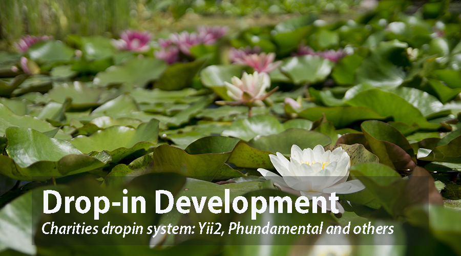

#Project Based in Yii2 and Phundament4

Dropin
Application to manage drop in sessions for grass roots organizations.

## Some features
- Simplify configuration file by [Phundamental 4](https://github.com/phundament/app)
- Dashboard theme based in [AdminLTE 2](http://almsaeedstudio.com/AdminLTE) for backend with extra plugins for chars.
- User Managment with RDAC to use roles and permisions.
